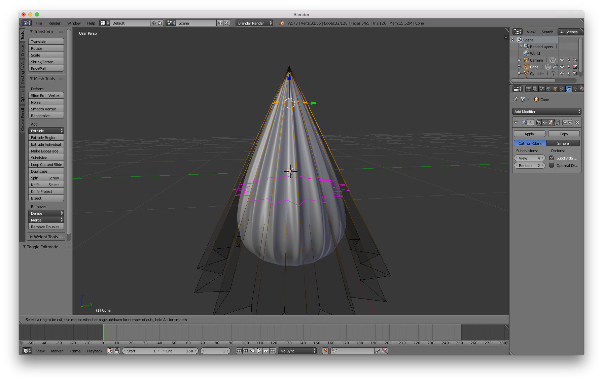

===============================
アポロチョコを作成する
===============================

`少しゆるめなBlender勉強会開催後＋ <https://lab1092.wordpress.com/2015/02/01/yurublend/>`__
で紹介した「アポロチョコ」のモデリング。

   :Version: 2.73a
   :キーワード: ループ選択、マテリアル、スムース化、チェッカー選択、ナイフツール、ループカット、エッジスライド

完成図
===================================

目標は「それなりに見えること」。今回の手順ではソリッドカラーのマテリアルを割り当てるのみで、
シーンセッティングまではしません。

開始
===================================

デフォルトキューブを消す
-------------------------

デフォルトキューブを消します。Cubeを選択した状態で[X]キーを押して削除します。

新規オブジェクトの作成
----------------------

Coneを追加します。その前に、追加する位置はグローバル座標原点にしたいので、
3Dカーソル(赤白の輪っか)を原点に移動させます。ずれている場合には[Shift]+[S]、
メニューから”Cursor to Center”を選択。

メッシュの追加。[Shift]+[A]キーを押したメニューからMesh >Cone と選んで、”Cone”を追加します。

.. image:: apollo_006.png

メッシュ編集
--------------------

マウスホイールでコーンの表示を大きくします。次にエディットモードにして、底面を見える位置に視点を変更します。

[A]キーで選択解除、[Alt]+[右クリック]でループ選択します。その状態で3Dビューのメニューから
Select > Checker Deselect を選択し、底部分の頂点が飛び飛びに選択されている状態にします。

.. image:: apollo_011.png

選択状態を保持し、[S]キーを押してサイズを変更します。すると星型のような形になります。そこで確定。

[A]キーで全ての頂点の選択を解除しておきます。

[K]キーを押し、[左クリック]を1回押してマウスを動かします。

直線が現れたところで[Z]キーを押し、非表示面も切る対象とします。

[Ctrl]+[左クリック]で切断する場所を仮確定にします(辺の中点)。[Enter]キーで確定。

エッジスライド([G],[G])で、選択中の頂点を上に持ち上げます。

Subdivision Surfaceモディファイアを適用します。
プロパティウィンドウのSpufaceボタンを押して出てくるAdd ModifierからSubdivision Surfaceを選択。

ツールシェルフのSmoothボタンをおして面をスムーズに表示、Subdivision Surfaceの細分化のレベルを上げておきます。

底部分の星型を出すために、[Ctrl]+[R]でループカットを行います。[Ctrl]+[R]を押した後、
マウスを動かしてピンクの線が出てくるところで[左ボタン]クリックして、下方向にエッジを移動させて確定します。

再度、[Ctrl]+[R]でループカットを行います。位置は適当に。ここがストロベリーチョコとミルクチョコの境界です。

上の頂点に丸みが欲しいので、頂点を少し下げます。[G],[Z]か、マニピュレーターの青い矢印をドラッグするかで、頂点を移動します。

マテリアルの追加・割り当て
---------------------------------

プロパティウィンドウのマテリアルボタンを押し、マテリアルの設定をはじめます。
マテリアルスロットの+ボタンを押して追加、さらに[+ New]ボタンを押して、
マテリアルを追加します。最初に設定したマテリアルはそのオブジェクトのデフォルトとして適用されます。

.. image:: apollo_038.png

.. image:: apollo_039.png

マテリアルカラーを設定します。

次の作業のために下半分を選択します。limitvisibleボタンを押して、
隠れた部分の頂点も選択できる状態にし、[B]キーの領域選択で選択状態にします。

マテリアルスロットの+ボタンを押して２つ目のマテリアルスロットを追加、マテリアルを追加します。

.. image:: apollo_047.png

2つ目のマテリアルを割り当てます。マテリアルスロットの下、Assignボタンを押します。
下半分の色が2番目のマテリアル色に変更されました。

一度エディットモードからオブジェクトモードにし、アングルを変えて確認します。
今のままでは縦に長いので、エディットモードで全選択([A])、[S]、[Z]でサイズ変更します。

完成です。

[EOF]